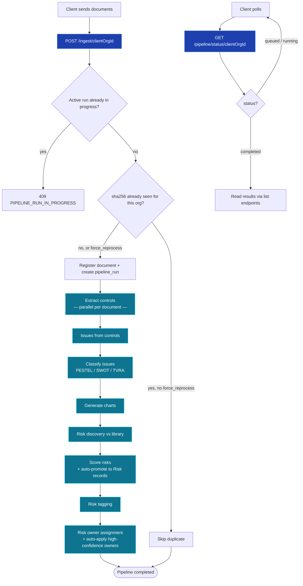
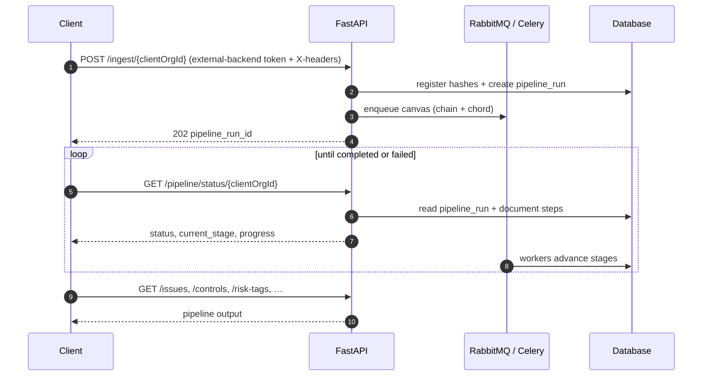
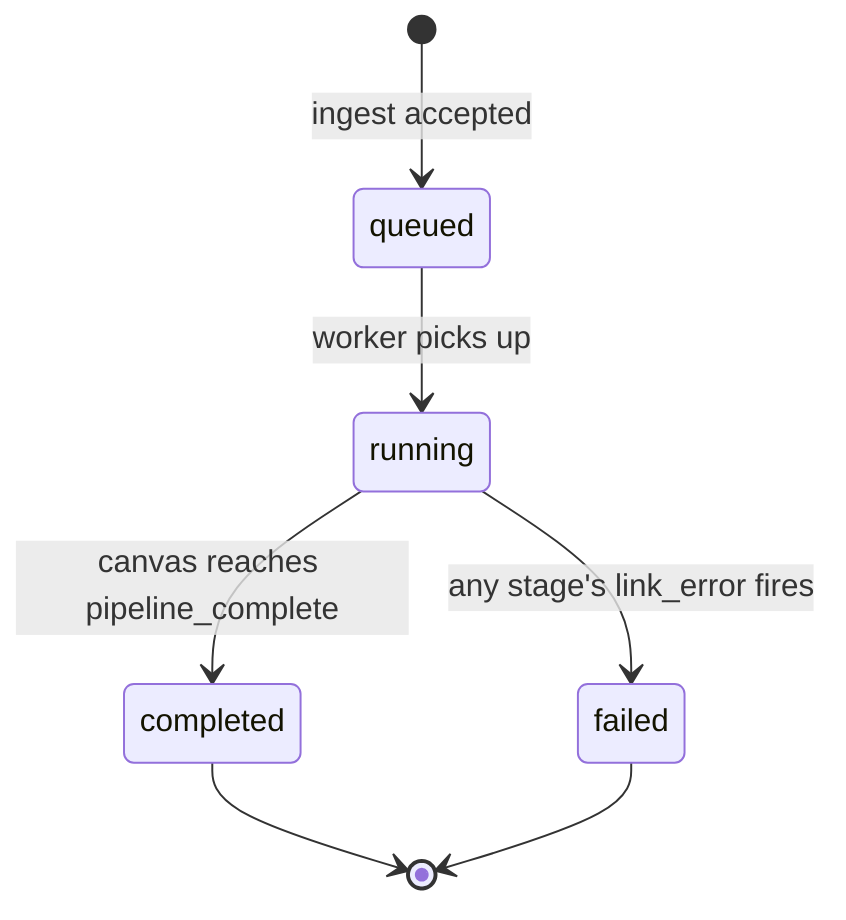

<Note>
**In plain English:** send your documents once. ISO Robot registers them, skips
anything it has already processed, and runs every downstream stage for you — no
manual job triggers, no Postman folder hopping.
</Note>

This is the **only** integration path for the risk pipeline — the per-stage
manual trigger endpoints have been removed. You call two endpoints:

1. **`POST /ingest/{clientOrgId}`** — deliver documents and start the pipeline.
2. **`GET /pipeline/status/{clientOrgId}`** — poll until the run completes.

Everything between those two calls — control extraction, issue synthesis,
classification, chart generation, risk discovery, risk scoring (which also
auto-promotes scored issues into `risks` rows), risk tagging, and risk owner
assignment — runs automatically in the background via Celery workers.

## What happens end-to-end



## Pipeline stages (automatic)

Each stage is a thin Celery task that reuses the **same domain functions** as
the (now-removed) manual endpoints — the business logic did not change, only
the orchestration. Extraction runs as a **Celery chord**: one task per
document, all in parallel, before the chain continues.

| Order | Stage | What it produces |
| --- | --- | --- |
| 1 | **`ingest_register`** | Documents hashed + registered in `document_registry`, deduplicated per org |
| 2 | **`extract_controls`** | Page-referenced `controls` from each new document (parallel chord) |
| 3 | **`issues_from_controls`** | Synthesised `issues` for the org (re-derived from all of the org's controls each run) |
| 4 | **`classify_issues`** | PESTEL / SWOT / TVRA `issue_classifications` for this run's new issues |
| 5 | **`generate_charts`** | Aggregated chart snapshot via `aggregate_classifications` |
| 6 | **`risk_discovery`** | `candidate_risks` matched to the seeded risk library |
| 7 | **`score_risks`** | `risk_assessments` (inherent + residual) **and** auto-created `risks` rows |
| 8 | **`risk_tagging`** | `risk_tags` applied automatically for high-confidence matches (`auto_apply=true`) |
| 9 | **`risk_owner_assignment`** | `risk_owner_assignments` proposed against the org hierarchy, with high-confidence matches auto-applied to `risks.owner_user_id` (`auto_apply=true`) |

<Info>
The chatbot's Milvus reindex remains a **separate, manual step** — it is not
part of the `/ingest` chain. See [End-to-End Flow](/process/end-to-end-flow)
for the full journey including that stage.
</Info>

## Document storage & deduplication

Every ingested file is fingerprinted with a **SHA-256 hash** before processing
starts. The hash is stored in `document_registry`, scoped to `(client_org_id, sha256)`.

| Scenario | Behaviour |
| --- | --- |
| New document (unknown hash for this org) | Registered and queued for the full pipeline |
| Duplicate hash, `force_reprocess` omitted/`false` | Skipped — returned with `"status": "duplicate"` |
| Duplicate hash, `force_reprocess: true` | Re-queued; reuses the stored file if still present, otherwise re-saves it |
| Non-PDF file, or empty file | Rejected — returned with `"status": "rejected"` (only PDF extraction is supported) |
| `save_to_storage: false` (default) | File written to a per-run temp directory for processing, then deleted once the run finishes |
| `save_to_storage: true` | File persisted under the org's document folder permanently |
| Another pipeline run already active for this org | Whole request rejected — `409 PIPELINE_RUN_IN_PROGRESS` |

<Tip>
Use `save_to_storage: false` when you only need analysis output and do not want
files kept on disk. Pass `save_to_storage: true` when you need an audit trail of
the original uploads.
</Tip>

## The two endpoints you need

### 1 · Start — ingest documents

```http
POST /ingest/{clientOrgId}
```

**Auth:** external-backend verify (see below) · **Response:** `202 Accepted`

Multipart form.

| Field | Required | Default | Description |
| --- | --- | --- | --- |
| `file` | Yes | — | One or more **PDF** files (repeat the field for batches) |
| `save_to_storage` | No | `PIPELINE_SAVE_TO_STORAGE_DEFAULT` (`false`) | Persist files to the org document folder |
| `force_reprocess` | No | `false` | Re-run pipeline even if this sha256 was already seen for this org |

**Response 202**

```json
{
  "status": "accepted",
  "message": "Pipeline run queued: 2 new/reprocessed document(s), 1 duplicate(s) skipped.",
  "data": {
    "client_org_id": "uuid",
    "pipeline_run_id": "uuid",
    "celery_task_id": "uuid",
    "status": "queued",
    "save_to_storage": false,
    "force_reprocess": false,
    "total_documents": 3,
    "new_documents": 2,
    "skipped_duplicate_documents": 1,
    "documents": [
      { "filename": "policy.pdf", "sha256": "…", "document_registry_id": "uuid", "document_id": "uuid", "status": "queued", "times_seen": 1 },
      { "filename": "old-policy.pdf", "sha256": "…", "document_registry_id": "uuid", "document_id": "uuid", "status": "duplicate", "times_seen": 2 }
    ],
    "status_url": "/api/v1/pipeline/status/{clientOrgId}?pipeline_run_id=uuid"
  }
}
```

Full request/response detail: [Pipeline API](/api-reference/pipeline).

### 2 · Poll — pipeline status

```http
GET /pipeline/status/{clientOrgId}
```

**Auth:** external-backend verify (see below) · **Response:** `200`

Returns the **latest pipeline run** for the organisation — or a specific one
via `?pipeline_run_id=` — including per-document/per-stage step detail. Poll
every few seconds while `status` is `queued` or `running`.

**Response 200 (excerpt)**

```json
{
  "status": "success",
  "data": {
    "client_org_id": "uuid",
    "pipeline_run_id": "uuid",
    "status": "running",
    "current_stage": "score_risks",
    "progress_percent": 75,
    "total_documents": 3,
    "new_documents": 2,
    "skipped_duplicate_documents": 1,
    "processed_documents": 2,
    "failed_documents": 0,
    "celery_task_id": "uuid",
    "error": null,
    "started_at": "2026-06-30T10:00:00Z",
    "completed_at": null,
    "created_at": "2026-06-30T09:59:58Z",
    "steps": [
      { "stage": "ingest_register", "status": "completed", "document_id": null, "filename": null, "error": null, "started_at": "…", "completed_at": "…" },
      { "stage": "extract_controls", "status": "completed", "document_id": "uuid", "filename": "policy.pdf", "error": null, "started_at": "…", "completed_at": "…" },
      { "stage": "score_risks", "status": "running", "document_id": null, "filename": null, "error": null, "started_at": "…", "completed_at": null }
    ]
  }
}
```

## Authentication (different from the rest of the API)

Both endpoints authenticate against an **external backend**, not ISO Robot's
own JWT. Send:

| Header | Value |
| --- | --- |
| `Authorization` | `Bearer <existing-backend token>` |
| `X-User-Id` | the calling user's id |
| `X-User-Email` | the calling user's email |
| `X-Org-Id` | the organisation id — **must equal** `{clientOrgId}` in the path |

See [Authentication](/api-reference/authentication) and the backend README for
the verify-backend contract, caching, and error codes.

## Recommended client flow

<Steps>
  <Step title="Seed the risk library (once per environment)">
    `POST /risk-library/seed-from-poc` if the library is not already populated.
    Risk discovery in the automated pipeline matches against this catalogue.
  </Step>
  <Step title="Ingest documents">
    `POST /ingest/{clientOrgId}` with your files. Capture `pipeline_run_id`.
  </Step>
  <Step title="Poll status">
    `GET /pipeline/status/{clientOrgId}` every 3–10 seconds until
    `status` is `completed` or `failed`.
  </Step>
  <Step title="Read results">
    Use the existing read endpoints — `GET /controls`, `GET /issues`,
    `GET /classifications/aggregate`, `GET /candidate-risks`,
    `GET /issues/{id}/risk-assessment`, `GET /risk-tags`, `GET /risks/{clientOrgId}`,
    `GET /risk-assignments` — to display output. Anything left `needs_review`
    (low-confidence owner match) can still be resolved via
    `POST /risk-assignments/apply-selected`.
  </Step>
</Steps>



## Pipeline status values



| `status` | Meaning |
| --- | --- |
| `queued` | Run created; canvas dispatched, not yet picked up by a worker |
| `running` | At least one stage is in progress |
| `completed` | The canvas reached `pipeline_complete` — check `failed_documents` for per-document extraction failures, which do **not** fail the whole run |
| `failed` | A stage raised an unhandled error and the canvas's `link_error` marked the run failed |

## The legacy manual flow has been removed

The per-stage endpoints that used to exist (`POST /control-documents/extract/{orgId}`,
`POST /issues/from-controls/{orgId}`, `POST /issues/classify`,
`POST /risk-discovery/run`, `POST /risk-scoring/run`, `POST /risk-tagging/run`,
`POST /risk-assignments/run`) are **no longer available** — every stage now
only runs as part of this automated pipeline. Two global (non-org-scoped)
endpoints remain for low-level debugging: `POST /controls/extract` and the
generic `POST /jobs`. See [Background Jobs](/process/background-jobs) for how
job types map to pipeline stages, and [System Architecture](/process/architecture)
for the Celery + RabbitMQ + Redis worker topology.
