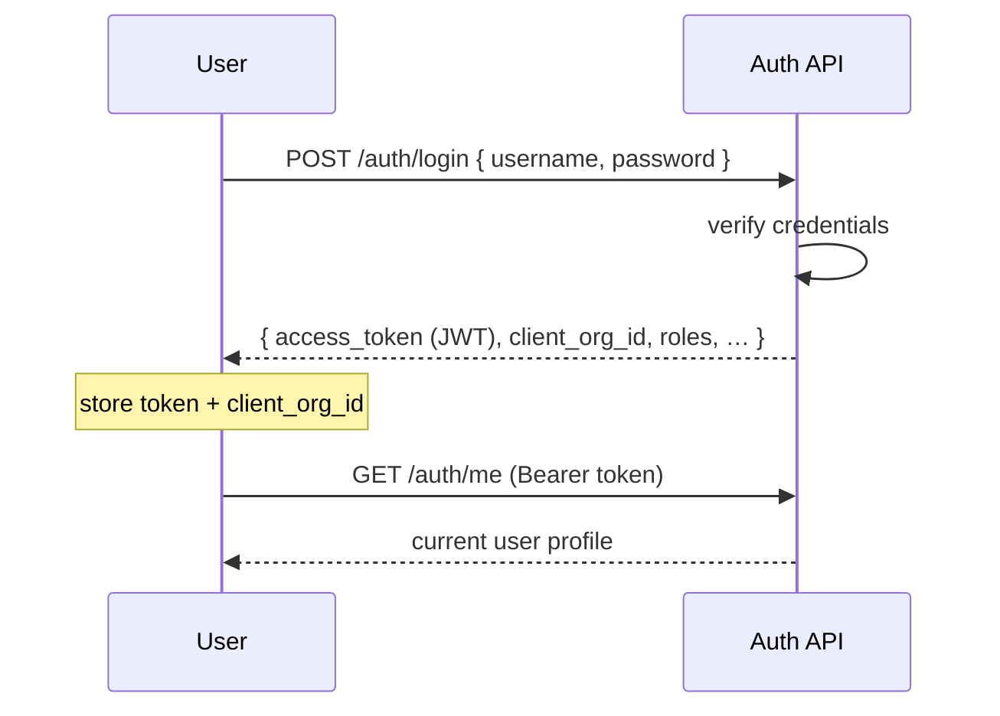

<Note>
**In plain English:** you sign in, and the system gives you a bearer pass (valid
for up to **60 days** with regular use) plus the name of the organisation you're
working on. That pass unlocks every later step and keeps each client's data
separate.
</Note>

<CardGroup cols={2}>
  <Card title="Why this stage matters" icon="lock">
    It is the security gate. No token, no pipeline — and the token decides **which
    organisation's** data you can see.
  </Card>
  <Card title="What you walk away with" icon="ticket">
    A bearer token and the active `client_org_id` that scopes everything downstream.
  </Card>
</CardGroup>

Authentication is the gate. Every stage after this one requires a bearer token,
and almost every record is scoped to the organisation tied to that token.

## ISO Robot is the identity provider

ISO Robot is a backend-to-backend service — there is no first-party frontend.
**It issues and validates the token itself**, so any number of client backends can
integrate against it with almost no code of their own. A client backend only ever:

1. **Gets a token** — relays the user's credentials to `POST /auth/login` and keeps
   the `access_token` it gets back.
2. **Uses the token** — sends it as `Authorization: Bearer <token>` on every ISO
   Robot call. ISO Robot validates its own JWT on every route (portal *and*
   pipeline), so the client passes the token straight through.
3. **(Optional) Introspects the token** — if the client guards its *own* resources
   with our token, it calls `POST /auth/verify` to check validity and read the
   bound identity. No JWT library, key, or shared secret required on their side —
   just an `X-Api-Key` header.

<Note>
This replaces the older model where ISO Robot forwarded the caller's token to an
**external** verify backend. That mode still exists for backward compatibility
(`AUTH_MODE=external`), but the default `AUTH_MODE=self` makes ISO Robot the
authority so clients don't have to run their own auth.
</Note>

## What happens

A user submits credentials. The service verifies them, issues a **signed JWT**
(the bearer token), and returns the user's profile and **active organisation**.
That `client_org_id` is the key that scopes documents, controls, issues, and
risks for the rest of the run.

### Token lifetime

The JWT is valid for **60 days** by default (`JWT_IDLE_MINUTES=86400`). The window
is **sliding**: every authenticated API call returns a fresh token in the
`X-Refresh-Token` response header, so active clients stay signed in without
calling `/auth/login` again. Idle sessions expire after 60 days with no requests.
Check `expires_at` via `POST /auth/verify` when introspecting a token.



## Inputs & outputs

<table>
  <thead><tr><th>In</th><th>Out</th></tr></thead>
  <tbody>
    <tr>
      <td>`username`, `password`</td>
      <td>`access_token`, `user_id`, `client_org_id`, `client_org_name`, `roles`</td>
    </tr>
  </tbody>
</table>

## Endpoints used

| Method | Path | Auth | Purpose |
| --- | --- | --- | --- |
| `POST` | `/auth/login` | **None** | Authenticate, return token + org |
| `POST` | `/auth/register` | **None** | Create a user (demo / admin) |
| `POST` | `/auth/verify` | `X-Api-Key` | Introspect a token → `{ valid, user_id, client_org_id, role, … }` |
| `GET` | `/auth/me` | Bearer | Return the logged-in user's profile |

<Note>
`/auth/login`, `/auth/register`, `/auth/verify`, and the health checks are the
**only** routes reachable without a session bearer token. Everything else returns
`401 UNAUTHORIZED` without a valid one. (`/auth/verify` authenticates the calling
backend with the `X-Api-Key` header instead — see `AUTH_INTROSPECTION_KEYS`.)
</Note>

### Token introspection

A downstream backend that received one of our tokens can check it without any
crypto of its own:

```json
POST /auth/verify          // header: X-Api-Key: <your client key>
{ "token": "<JWT>" }
```

```json
{
  "status": "success",
  "data": {
    "valid": true,
    "user_id": "uuid",
    "email": "analyst@demo.local",
    "client_org_id": "uuid",
    "role": "analyst",
    "expires_at": 1751847600
  }
}
```

An expired, malformed, or revoked (disabled-user) token is a normal
`{ "valid": false }` result with HTTP `200` — not an error. Only a missing or wrong
`X-Api-Key` returns `401`.

### Login request

```json
{
  "username": "analyst@demo.local",
  "password": "Passw0rd!"
}
```

### Login response

```json
{
  "status": "success",
  "message": "Login successful",
  "data": {
    "access_token": "<JWT>",
    "user_id": "uuid",
    "client_org_id": "uuid",
    "client_org_name": "…",
    "tenant_id": "…",
    "folders": { "control_documents_folder": "…" },
    "roles": ["analyst"]
  }
}
```

### Failure modes

| HTTP | code | Meaning |
| --- | --- | --- |
| 401 | `AUTH_FAILED` | Wrong username/password |
| 403 | `UNAUTHORIZED` | Account disabled |
| 404 | `CLIENT_ORG_NOT_FOUND` | Org attached to user is missing |

## Roles

| Role | Can do |
| --- | --- |
| `analyst` | Run the full pipeline for their own organisation |
| `admin` | Create organisations and perform cross-org operations |

<Warning>
Treat the `access_token` as a secret. Send it only over the `Authorization`
header, never in a query string or log line.
</Warning>

## What feeds the next stage

The token authorises every later call, and `client_org_id` is the org you will
upload documents against in [Stage 02 · Organisation & Documents](/flow/02-org-documents).

Full request/response detail: [API Reference → Authentication](/api-reference/authentication).
