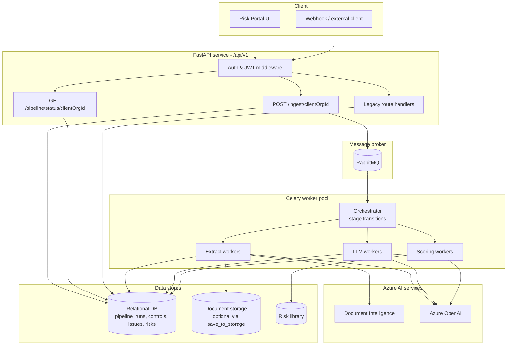

<Note>
**In plain English:** ISO Robot is one API that accepts documents, a message queue
that hands work to background workers, and a database that tracks every step — so
you ingest once and the full risk pipeline runs without manual intervention.
</Note>

ISO Robot is a **FastAPI** service backed by **PostgreSQL**, orchestrated by
**Celery workers** over **RabbitMQ** (with Redis as the result backend), fronted
by a React portal, and augmented by Azure AI services. The defining design choice
is that **all heavy work runs asynchronously** — as an automated, **batched**
pipeline that fans work out across the worker pool, with individual background
jobs available for manual/debug use.

<Note>
Postgres is the default store (Docker Compose ships a `postgres` service and the
containers' `DB_URI` is derived from the same `POSTGRES_*` variables). SQLite is
still supported for local dev by leaving `DB_URI` empty, but Postgres is required
for real worker concurrency — a single SQLite file serialises all writers.
</Note>

## Component map



## Automated pipeline vs legacy jobs

<AccordionGroup>
  <Accordion title="Automated pipeline (recommended)" icon="bolt">
    **`POST /ingest/{clientOrgId}`** registers documents (by content hash),
    creates a `pipeline_run`, and enqueues the full stage chain. **`GET /pipeline/status/{clientOrgId}`**
    returns org-level progress — current stage, per-document status, and stage
    counters. No per-stage job polling required.

    See [Automated Ingest Pipeline](/flow/00-automated-ingest-pipeline) and
    [Pipeline API](/api-reference/pipeline).
  </Accordion>
  <Accordion title="Legacy background jobs (global, non-org-scoped)" icon="gears">
    The **org-scoped** per-stage manual triggers
    (`/control-documents/extract/{orgId}`, `/issues/from-controls/{orgId}`,
    `/issues/classify`, `/risk-discovery/run`, `/risk-scoring/run`,
    `/risk-tagging/run`, `/risk-assignments/run`) have been **removed** — those stages now only run inside
    the automated `/ingest` pipeline. Two global, non-org-scoped endpoints remain
    for debugging: `POST /controls/extract` and the generic `POST /jobs` (job
    types `extract_controls`, `classify_issues`, `risk_discovery`, …), both polled
    via **`GET /jobs/{jobId}`**. See [Background Jobs](/process/background-jobs).
  </Accordion>
</AccordionGroup>

## Batched stage state machine

The automated pipeline advances one stage at a time, but each stage is a
**dispatch → batch → finalize** state machine rather than a single task:

1. **Dispatch** splits the stage's work into batches (per document, or per N
   items) and records a step row for each.
2. **Batch tasks** run those batches in parallel across the worker queues (a
   Celery *chord*), each making its LLM calls with bounded concurrency.
3. **Finalize** joins the batch results, writes a run-level summary, and advances
   to the next stage.


Each task wraps existing domain functions (`run_extract_controls_job`,
`generate_issues_for_control_batch`, `classify_issues_job`,
`aggregate_classifications`, `run_risk_discovery`, `score_risks_job`,
`run_risk_tagging_job`, `run_risk_owner_assignment_job`) — the business logic is
unchanged; the batched dispatch/orchestration is what's new. This is the default
**v2** orchestration (`PIPELINE_V2_ENABLED=true`); the legacy single-chain path
remains for rollback.

## Resilience: retries, dead-letter queues, back-pressure

- **Transient failures** (rate limits, timeouts, dropped connections) are retried
  with jittered exponential backoff — both at the LLM-call level and, for whole
  batches, at the Celery-task level (`CELERY_BATCH_MAX_RETRIES`, default 3).
- **Exhausted batches** are published to a per-queue **dead-letter queue**
  (`<queue>.dlq`) and recorded as failed **without stalling the run** — the stage
  still finalises with a partial result. `scripts/replay_dlq.py` re-queues them
  after the root cause is fixed.
- **A failed run never blocks the queue**: the org's next `waiting` run auto-starts.
- **Item-level isolation**: one bad document, control batch, or issue degrades to
  a heuristic fallback (or is skipped) instead of failing the stage.

## Worker queues

| Queue | Tasks | Scale when |
| --- | --- | --- |
| `pipeline.orchestrator` | Start run, stage transitions, status updates | Low (1–2 workers) |
| `pipeline.extract` | Ingest, `extract_controls` | High (PDF / Document Intelligence bound) |
| `pipeline.llm` | Issues, classify, discovery, tagging, owner assignment | High (OpenAI rate limits) |
| `pipeline.scoring` | `score_risks` | Medium |

Workers are **horizontally scalable** — add more Celery processes per queue as
throughput grows. A Redis (or RabbitMQ) result backend stores task outcomes; the
relational DB is the source of truth for pipeline state.

## The layers

<AccordionGroup>
  <Accordion title="API surface (FastAPI, /api/v1)" icon="server">
    A single versioned API. Public routes (`/health`, `/auth/login`,
    `/auth/register`) need no token; everything else requires
    `Authorization: Bearer <token>`. Handlers validate input, enforce org
    ownership, read/write the database, and enqueue Celery tasks (or legacy
    background jobs).
  </Accordion>
  <Accordion title="Document registry & deduplication" icon="fingerprint">
    Every ingested file is hashed (SHA-256). The registry stores
    `content_hash`, org id, optional storage path, and processing status. Duplicate
    hashes that already completed are skipped unless `force_reprocess: true`.
    **`save_to_storage: false`** (default) processes without persisting files to
    disk.
  </Accordion>
  <Accordion title="Azure Document Intelligence" icon="file-magnifying-glass">
    Converts PDFs into layout-aware text with `[PAGE N]` markers so every
    extracted control keeps a **source page**. Falls back to page-batch processing
    or local PDF text extraction when needed.
  </Accordion>
  <Accordion title="Azure OpenAI (JSON chat)" icon="robot">
    Performs judgment work: extracting controls, synthesising issues,
    classifying into PESTEL/SWOT/TVRA, proposing candidate risks, scoring, and
    tagging. All calls return strict JSON. Deterministic heuristics provide
    fallback when the model is unavailable.
  </Accordion>
  <Accordion title="Data stores" icon="database">
    **PostgreSQL** holds pipeline runs, document registry, controls, issues,
    classifications, candidate risks, assessments, portal risks, and job logs;
    the schema is created/migrated automatically on API startup (Alembic).
    **Milvus** holds the vector index for the chatbot, kept in sync incrementally
    as each stage writes. Uploaded files live in per-organisation folders when
    `save_to_storage: true`. A seeded **risk library** is the catalogue that
    discovery matches against.
  </Accordion>
  <Accordion title="Observability" icon="chart-line">
    Prometheus scrapes the API, Celery workers, and RabbitMQ; **Grafana**
    dashboards cover API/Celery health, RabbitMQ queues, **LLM performance**
    (latency, tokens, cost, retries), and **pipeline stages** (per-stage/batch
    durations, dead-lettered batches). Structured logs flow to **Loki**; traces
    to **Tempo**. Alerts fire on high LLM error/latency, stalled pipelines, and
    dead-lettered batches.
  </Accordion>
</AccordionGroup>

## Multi-tenancy & ownership

Every meaningful record is scoped to a **client organisation** (`client_org_id`).
Login returns the caller's active org; handlers reject cross-org access with
`403 FORBIDDEN`. Pipeline runs and status queries are always org-scoped.

## Determinism where it matters

The platform deliberately splits **judgment** from **calculation**:

| Concern | Owner | Why |
| --- | --- | --- |
| Qualitative judgments (likelihood, consequence, control effectiveness) | Azure OpenAI | Requires reading and reasoning over text |
| Inherent risk, residual risk, recommended response | Fixed scoring matrices | Must be **repeatable, tunable, and auditable** |

See [Risk Scoring](/flow/07-risk-scoring).

## Base URL

Deployed API (VM):

```text
http://157.20.190.175:8000/api/v1
```

The root health check lives one level up at `http://157.20.190.175:8000/health`.
Full conventions are documented in [API Conventions](/api-reference/conventions).
