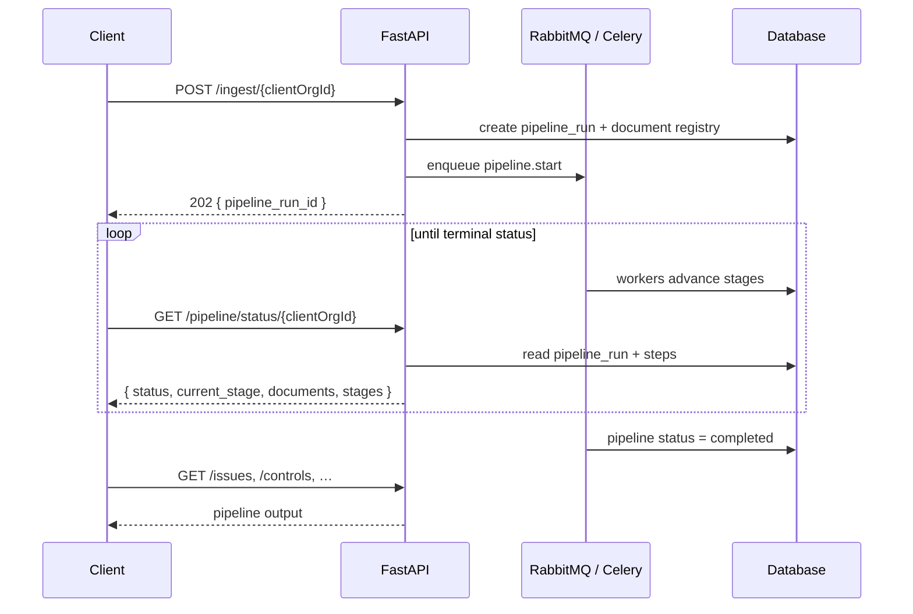
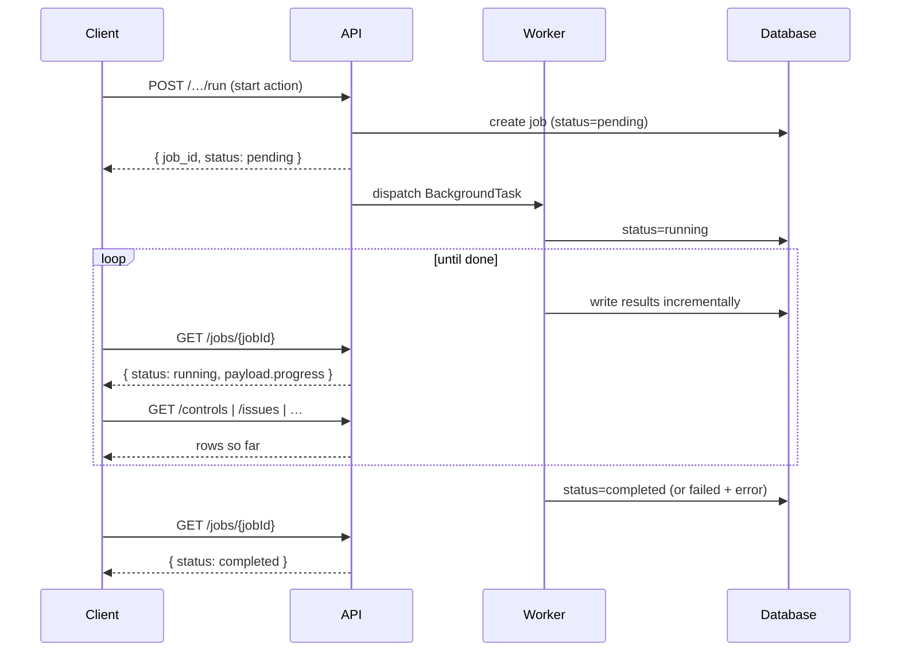
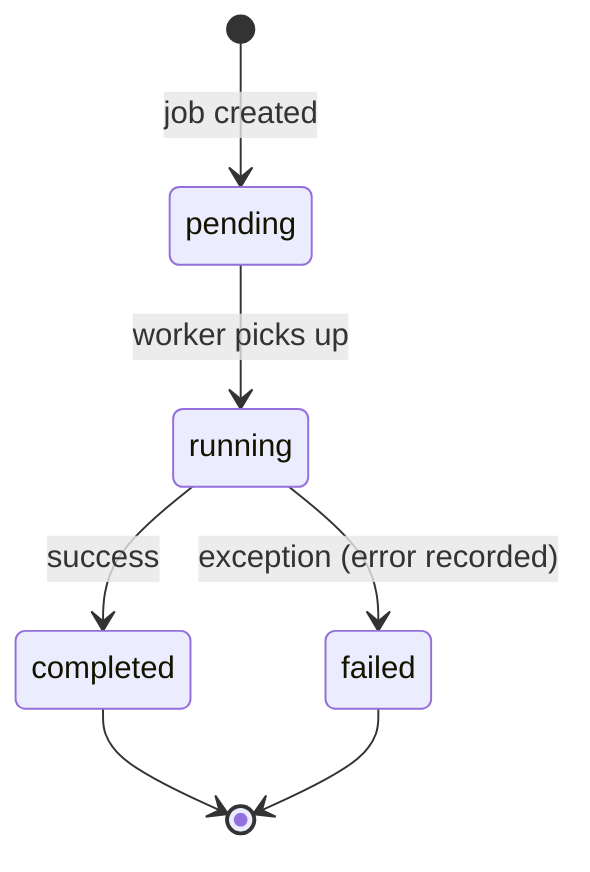
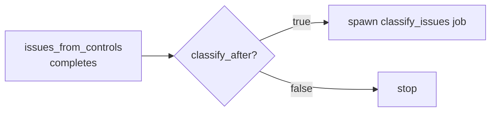

<Note>
**In plain English:** some steps take a while (reading a 200-page PDF, scoring
dozens of risks). Instead of freezing while it works, ISO Robot hands you a
ticket and does the job in the background. You check the ticket until it says
"done," and results appear as they're ready.
</Note>

The expensive parts of the pipeline — parsing PDFs, calling the LLM, scoring risks —
can take seconds to minutes. Rather than block the caller, ISO Robot runs them as
**background work** via Celery. There are two patterns:

1. **Automated pipeline** (the only way to run the org-scoped risk workflow) —
   one ingest call chains all stages; poll `GET /pipeline/status/{clientOrgId}`.
   See [Automated Ingest Pipeline](/flow/00-automated-ingest-pipeline).
2. **Legacy global job pattern** — two non-org-scoped endpoints
   (`POST /controls/extract`, `POST /jobs`) still start a single job directly;
   poll `GET /jobs/{jobId}`. The **org-scoped** per-stage trigger endpoints that
   used to exist have been removed — see the table below.

## Automated pipeline pattern

<Steps>
  <Step title="Ingest">
    `POST /ingest/{clientOrgId}` returns **immediately** with a `pipeline_run_id`
    and `202 Accepted`.
  </Step>
  <Step title="Poll status">
    `GET /pipeline/status/{clientOrgId}` until `status` is `completed` or
    `failed`. One call shows every stage and every document.
  </Step>
  <Step title="Fetch data">
    Read results via list endpoints (`/controls`, `/issues`, `/risk-tags`, …).
  </Step>
</Steps>



### Pipeline run status

```json
{
  "pipeline_run_id": "uuid",
  "client_org_id": "uuid",
  "status": "queued | running | completed | failed",
  "current_stage": "extract_controls | issues_from_controls | … | complete",
  "progress_percent": 72,
  "total_documents": 5,
  "processed_documents": 3,
  "failed_documents": 0,
  "steps": [
    { "stage": "extract_controls", "status": "completed", "document_id": "uuid" },
    { "stage": "score_risks", "status": "running", "document_id": null }
  ]
}
```

Full field reference: [Pipeline API](/api-reference/pipeline).

---

## Legacy global job pattern

`POST /controls/extract` and the generic `POST /jobs` (both global,
non-org-scoped) follow the same three-beat pattern.

<Steps>
  <Step title="Start">
    `POST` the action endpoint. It returns **immediately** with a job in
    `pending` status and a `job_id`.
  </Step>
  <Step title="Poll">
    `GET /jobs/{jobId}` repeatedly until `status` is `completed` or `failed`.
  </Step>
  <Step title="Fetch data">
    Read the result via the relevant list/detail endpoint. Rows often appear
    **while the job is still running**, because workers commit incrementally.
  </Step>
</Steps>



## Job lifecycle



A polled job returns:

```json
{
  "id": "uuid",
  "type": "extract_controls",
  "status": "pending | running | completed | failed",
  "payload": { "progress": { } },
  "error": null,
  "created_at": "…",
  "updated_at": "…"
}
```

<Info>
The `payload.progress` block is updated as work proceeds — for extraction it
reports the current document, segment, and running control count, so a UI can show
a live progress bar.
</Info>

## Job types

These job types map to pipeline stages. All of them now run **only** inside
the automated `/ingest` pipeline as Celery tasks (`iso_robot.pipeline.tasks`) —
the org-scoped manual start endpoints that used to trigger them individually
have been **removed**.

| Job type | Pipeline stage | Removed manual endpoint | What it produces |
| --- | --- | --- | --- |
| `extract_controls` | 2 | ~~`POST /control-documents/extract/{orgId}`~~ | `controls` rows from org PDFs |
| `issues_from_controls` | 3 | ~~`POST /issues/from-controls/{orgId}`~~ | `issues` synthesised from controls |
| `classify_issues` | 4 | ~~`POST /issues/classify`~~ | PESTEL / SWOT / TVRA classifications |
| `generate_charts` | 5 | *(pipeline only)* | Chart snapshot from `aggregate_classifications` |
| `risk_discovery` | 6 | ~~`POST /risk-discovery/run`~~ | `candidate_risks` matched to the library |
| `score_risks` | 7 | ~~`POST /risk-scoring/run`~~ | `risk_assessments` **and** auto-created `risks` rows |
| `risk_tagging` | 8 | ~~`POST /risk-tagging/run`~~ | `risk_tags`, auto-applied above the confidence threshold |
| `risk_owner_assignment` | 9 | ~~`POST /risk-assignments/run`~~ | Owner recommendations, auto-applied to `risks.owner_user_id` above the confidence threshold |
| `reindex_org` | — | `POST /chatbot/reindex` (still available; not part of `/ingest`) | Milvus knowledge index (Stage 11) |

The two still-existing legacy job types — `extract_controls` via
`POST /controls/extract`, and any type via the generic `POST /jobs` — are
**global** (not scoped to a `client_org_id`) and intended for debugging only.

## Chained jobs

Some actions fan out. When issues are generated with `classify_after: true`, the
`issues_from_controls` job marks itself **completed as soon as the issues exist**,
then spawns a **separate** `classify_issues` job so classification can be tracked
independently and never blocks issue creation.



## Resilience

- A single failing item never kills a batch — scoring and extraction log the
  failure and continue with the rest.
- When the LLM or Document Intelligence is unavailable, the pipeline falls back to
  deterministic heuristics where a fallback exists, so the chain still produces
  output.
- Failures are captured in the job's `error` field for inspection.

<Tip>
**Automated vs legacy polling.** Use `GET /pipeline/status/{clientOrgId}` for the
full org pipeline. Use `GET /jobs/{id}` only for the two remaining global,
non-org-scoped debug endpoints. During a run, list endpoints (`/controls`,
`/issues`) show what's in the database right now.
</Tip>
