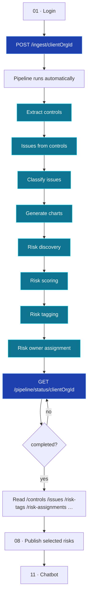
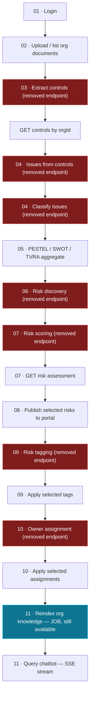

This page is the map. It shows how documents become a scored, tagged risk register,
then covers the optional publish, assign, and chatbot stages.

<Note>
**Read this first.** The **automated ingest path** (two API calls) is the
**only** way to run stages 03–10 — the org-scoped manual per-stage endpoints
described further down have been **removed**. That section is kept for
historical/domain-logic reference only.
</Note>

## Automated path (recommended)

One ingest call starts the full pipeline. One status call tracks progress.

Full detail: [Automated Ingest Pipeline](/flow/00-automated-ingest-pipeline) ·
[Pipeline API](/api-reference/pipeline).

<Info>
**What runs under the hood.** The pipeline is a batched **dispatch → batch →
finalize** state machine (default v2, `PIPELINE_V2_ENABLED=true`), not a single
static chain — item-heavy stages fan out into batches across the worker pool and
make their LLM calls concurrently. The stage **order above is unchanged**, but the
behaviour is now **incremental**: issue generation derives only from each run's
new controls and existing controls, issues, and risks are never wiped, while risk
discovery and chart aggregation are **org-scoped**. A second ingest while a run is
active is queued as a **`waiting`** run rather than rejected. Pipeline state lives
in **PostgreSQL** by default (SQLite still works for local dev). The chatbot Milvus
reindex remains a **separate, manual** step outside the `/ingest` chain.
</Info>

### Automated happy path

<Steps>
  <Step title="Log in">
    `POST /auth/login` → save `access_token` and `client_org_id`.
  </Step>
  <Step title="Seed risk library (once)">
    `POST /risk-library/seed-from-poc` if not already done.
  </Step>
  <Step title="Ingest documents">
    `POST /ingest/{clientOrgId}` with files and optional `save_to_storage` flag.
    Capture `pipeline_run_id` from the `202` response.
  </Step>
  <Step title="Poll pipeline status">
    `GET /pipeline/status/{clientOrgId}` every 3–10 s until `status` is
    `completed` or `failed`.
  </Step>
  <Step title="Review output">
    `GET /controls`, `GET /issues`, `GET /classifications/aggregate`,
    `GET /candidate-risks`, `GET /issues/{id}/risk-assessment`, `GET /risk-tags`,
    `GET /risk-assignments`.
  </Step>
  <Step title="Publish & beyond (manual approval)">
    `POST /risks/upload-selected` for any manually-selected risks →
    `POST /risk-assignments/apply-selected` for anything left `needs_review` →
    chatbot reindex & query.
  </Step>
</Steps>

---

## Manual path — **removed** (historical reference only)

<Warning>
Every endpoint in this section that used to trigger stages 03–10 individually
(`POST /control-documents/extract/{orgId}`, `POST /issues/from-controls/{orgId}`,
`POST /issues/classify`, `POST /risk-discovery/run`, `POST /risk-scoring/run`,
`POST /risk-tagging/run`, `POST /risk-assignments/run`) has been **removed**.
This diagram is kept only to document how the domain logic used to be invoked
one stage at a time — for any real integration, use the
[automated path](#automated-path-recommended) above.
</Warning>

Two global (non-org-scoped) job endpoints remain for low-level debugging:
`POST /controls/extract` and the generic `POST /jobs` — see
[Background Jobs](/process/background-jobs).

---

## Stage-by-stage summary

<table>
  <thead>
    <tr><th>Stage</th><th>You provide</th><th>You get back</th><th>Automated?</th></tr>
  </thead>
  <tbody>
    <tr>
      <td>[01 Authentication](/flow/01-authentication)</td>
      <td>Username & password</td>
      <td>Bearer token + active org id</td>
      <td>Manual (prerequisite)</td>
    </tr>
    <tr>
      <td>[Automated Ingest](/flow/00-automated-ingest-pipeline)</td>
      <td>Files via `POST /ingest/{orgId}`</td>
      <td>Full pipeline output + `pipeline_run_id`</td>
      <td><strong>Yes — stages 03–10</strong></td>
    </tr>
    <tr>
      <td>[02 Org & Documents](/flow/02-org-documents)</td>
      <td>Org profile + documents (or use ingest)</td>
      <td>Stored documents & demography</td>
      <td>Optional via `save_to_storage`</td>
    </tr>
    <tr>
      <td>[03 Extract Controls](/flow/03-extract-controls)</td>
      <td>Trigger on org PDFs</td>
      <td>Page-referenced controls</td>
      <td>Yes</td>
    </tr>
    <tr>
      <td>[04 Issues](/flow/04-issues)</td>
      <td>Trigger on org controls</td>
      <td>Risk issues (+ classification)</td>
      <td>Yes</td>
    </tr>
    <tr>
      <td>[05 Classifications](/flow/05-classifications)</td>
      <td>Classified issues</td>
      <td>PESTEL / SWOT / TVRA chart data</td>
      <td>Yes</td>
    </tr>
    <tr>
      <td>[06 Risk Discovery](/flow/06-risk-discovery)</td>
      <td>Seeded library + issues</td>
      <td>Candidate risks matched to library</td>
      <td>Yes</td>
    </tr>
    <tr>
      <td>[07 Risk Scoring](/flow/07-risk-scoring)</td>
      <td>Org issues</td>
      <td>Inherent & residual risk assessments</td>
      <td>Yes</td>
    </tr>
    <tr>
      <td>[09 Risk Tagging](/flow/09-risk-tagging)</td>
      <td>Scored issues</td>
      <td>Tag recommendations</td>
      <td>Yes</td>
    </tr>
    <tr>
      <td>[08 Risks Portal](/flow/08-risks-portal)</td>
      <td>Analyst-selected risks</td>
      <td>Published risk register</td>
      <td>Manual approval</td>
    </tr>
    <tr>
      <td>[10 Risk Owner Assignment](/flow/10-risk-owner-assignment)</td>
      <td>Hierarchy + tagged risks</td>
      <td>Accountable owners</td>
      <td>Yes (high-confidence auto-applied; rest need approval)</td>
    </tr>
    <tr>
      <td>[11 Chatbot](/flow/11-chatbot)</td>
      <td>A question in plain English</td>
      <td>Streamed, cited answer</td>
      <td>Manual trigger</td>
    </tr>
  </tbody>
</table>

<Tip>
While the automated pipeline runs, poll `GET /pipeline/status/{clientOrgId}` for
org-level progress. You can also re-hit list endpoints (`/controls`, `/issues`) to
watch rows accumulate incrementally.
</Tip>
